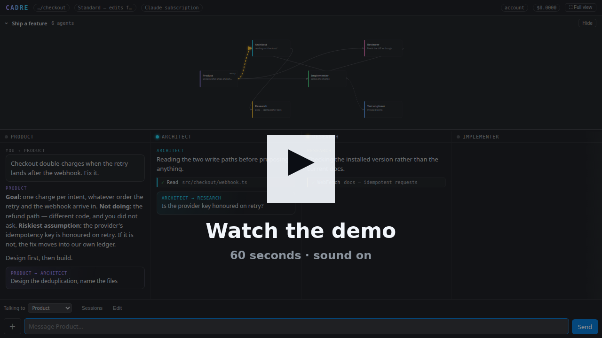
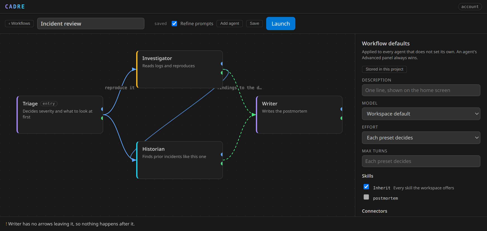
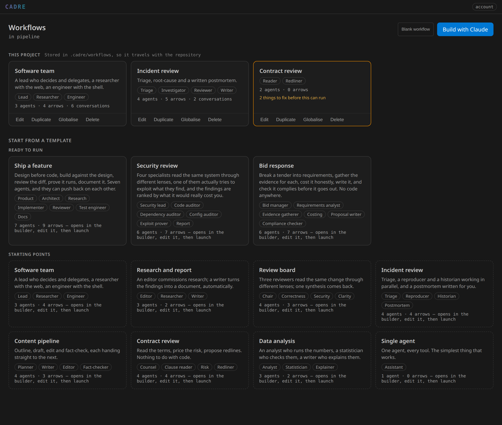
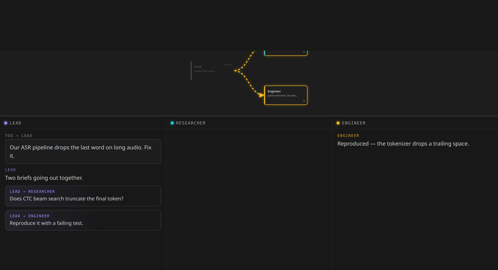
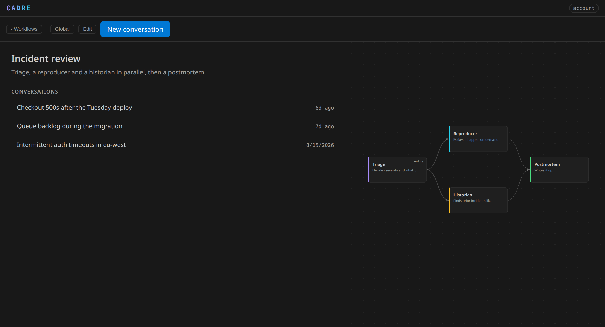

<div align="center">


# Cadre

**Build a team of AI agents, wire them together with arrows, and watch them work.**

You draw the workflow — as many agents as you want, each with its own prompt and its own
tools — and Cadre runs it inside VS Code, one live lane per agent.

[](https://github.com/Muhammad4hmed/cadre/raw/main/media/demo.mp4)

<sub><b><a href="https://github.com/Muhammad4hmed/cadre/raw/main/media/demo.mp4">▶ Watch the 60-second demo</a></b> — a team designed, shaped, and running.</sub>



</div>

---

## What it actually is

Most AI coding tools are one assistant doing everything. Cadre is however many you need,
with different jobs, different tools, and explicit relationships between them.

A **workflow** is a set of agents and the arrows between them. You name each agent, say
what it is for in a sentence or two, choose how much of the machine it is trusted with,
and draw the arrows. Launch it once and it is saved; after that you open it and work.

Or describe the pipeline and let Claude draw it. **Build with Claude** takes "read
incoming tickets, work out which are real bugs, reproduce them against our repo, draft a
reply" and returns the agents, their capabilities, their prompts and the arrows — into the
builder, never launched, with anything that needs fixing flagged.



## The two arrows

The kind of arrow is chosen by which port you drag from, because by the time you have
dropped it you have already forgotten which one you meant.

| | |
|---|---|
| **A → B** *delegate* | B becomes a tool on A. A writes a brief, B runs with an empty context, returns one report, A carries on. **Cycles are fine** — A→B→A is how a peer asks back — so depth is bounded by a counter rather than by the shape of the graph. At the cap the delegate tools are denied outright, so the bound holds on `autonomous` too, where nothing prompts. |
| **A ⇥ B** *then* | B starts automatically when A finishes, with A's output as its input. No tool call, no decision. These must be acyclic: a loop is kept — a half-drawn workflow is a normal state to be in — but Launch is refused until you break it. |

You talk to the **entry agent** by default, and a dropdown switches to any other — it has
not seen what you said to anyone else, and Cadre says so rather than letting you find out
from a confused reply.

## You do not have to know the protocol

You write "you review contracts". Cadre supplies the rest of the prompt from the arrows
you drew: what a brief is, that the teammate starts with an empty context, what shape a
report takes, where its output is about to be handed. An agent is told about the arrows it
has and nothing about the arrows it does not.

Turn on **Refine prompts** (default) and a one-line description becomes a real system
prompt — what good work looks like in that role, the failure modes of doing it badly, what
to do when the task is underspecified. You see the result before it is kept, and
*Revert to what I wrote* is always there.

## Capabilities

Four presets, because the interesting distinctions are few:

| | |
|---|---|
| **Read-only** | Reads the project and delegates. No shell, no editing outside its own notes. |
| **Research** | Web search and fetch, plus read-only project access. |
| **Build** | Files and a shell. This is the one that actually changes things. |
| **Everything** | Every tool at once — and the least likely to keep its lane. |

The distinction that matters is whether an agent has hands. An agent that can quietly do
the work itself will, and then its teammates are decoration — so a read-only agent is
*enforced* to `.cadre/` and your docs folder, not merely asked.

Model, effort, turn limit, skills and connectors can also be set once for the **whole
workflow** — the builder panel you get when no agent is selected. Three tiers, narrowest
wins: the agent, then the workflow, then the workspace.

Edits autosave — 45 seconds after you stop, and always before you leave the builder,
including whatever is still in a box you have not clicked away from — and
**Ctrl+Z** undoes anything on the canvas.

**Advanced** opens the rest: model and effort per agent, individual tools, which skills it
may use, which connectors it may reach, its turn limit. The model list is read from your
installed Claude Code rather than hardcoded, so it has whatever you have — Fable, Opus,
Sonnet, Haiku — with the right identifiers, and it knows which models take an effort level
and which do not. An agent's explicit choice
overrides its preset — except for the tools that fan work out off-screen, which no
configuration can grant.

## Watching it work

A live map of the graph sits above the board. Agents that are not working recede to grey;
the ones that are glow and pulse, showing what they are doing rather than their job title,
with the arrows carrying work animated along their length. It uses the positions you laid
out, so the map and the builder are the same picture — and the separator between the map
and the lanes drags, takes arrow keys, and remembers where you left it.



Below it, one lane per agent, however many there are. Past three or four the board scrolls
sideways rather than squeezing every lane past readability.

Status lights that pulse only while an agent is genuinely working, delegation cards showing
what was handed to whom, tool calls that resolve to ✓ or ✕ **with the reason when they
fail**, collapsed reasoning, and a running cost that counts the whole team rather than
just the agent you are talking to.

## Requirements

[Claude Code](https://claude.com/claude-code) installed and signed in, or an Anthropic
API key. Cadre never holds your subscription login — it runs the CLI you already have.

## Where workflows live

Your choice, per workflow:

| | |
|---|---|
| **This project** | `.cadre/workflows/*.json`, travelling with the repository — reviewable in a diff, shareable by committing, fixable by hand at 2am without running us |
| **Everywhere** | `~/.cadre/workflows/`, available in every project you open |

*Globalise* and *Localise* move one either way. A local workflow shadows a global one of
the same id, so a project can pin its own version of something shared.

Your workflow and its history are written by rename rather than in place, so a
window closed at the wrong moment cannot leave either one half-written.

Two windows open on one project can both record conversations without losing
each other's — the list is locked for the moment it takes to update, and a lock
left behind by a window that was killed is recognised and taken.

Conversations always stay with the project, even for a global workflow — the same workflow
used in three repositories has three separate histories, and one merged list would be
misleading. Each is named by Claude's own summary of it, and resumes with the transcript
replayed rather than just the model's memory.



## Templates

Fourteen, in two groups, and deliberately not all about code — the point of the model is
that it does not care.

**Ready to run** — six or seven agents, peers that push back on each other, and prompts
written for the job rather than for the demo:

| | |
|---|---|
| **Ship a feature** | Product decides scope, an Architect designs before anyone writes, the Implementer can argue with both, a Reviewer sends real defects back, a Test engineer proves it, Docs writes it up |
| **Security review** | A lead who finds the trust boundary, three specialists on source, dependencies and deployment, and an agent that actually tries to exploit what they find |
| **Bid response** | Qualify, break the tender down, gather provable evidence, cost it honestly, write it, and check it complies |
| **Hiring team** | Decide whether the role should exist, map the market, screen against a written bar, design an interview that measures the work, verify what is checkable, plan the first ninety days |
| **Marketing team** | Nothing is written until the claim is settled and the measure is agreed — audience research, positioning, content, distribution, and measurement that can come back negative |
| **Outreach team** | Targeting with disqualifiers, per-account research where "no trigger found" is a real answer, copy a person would answer, compliance that can say no, and a reviewer who reads it as the recipient |

**Starting points** — smaller shapes to build on:

| | |
|---|---|
| **Software team** | The workflow this extension used to be, in the general model — the honest test of whether the general model is actually general |
| **Review board** | Three reviewers read the same change through correctness, security and clarity |
| **Incident review** | Triage, a reproducer and a historian in parallel, then a postmortem |
| **Research and report** | An editor commissions research; a writer drafts from it automatically |
| **Content pipeline** | Outline → draft → edit → fact-check, a chain of handoffs |
| **Contract review** | Read the terms, price the risk, propose redlines. No code anywhere |
| **Data analysis** | An analyst who runs it, a statistician who checks it, a writer who explains it |
| **Single agent** | One agent, every tool |

## Safety

Autonomy is enforced by the extension, not requested politely: a **restrictive-only policy
tier** that can tighten but never widen, so it holds even if your own Claude Code settings
grant more than you remember.

| Level | |
|---|---|
| `supervised` | Every edit and command approved |
| `standard` | Edits flow; destructive commands ask |
| `plan` | Designs and reports, changes nothing |
| `autonomous` | No prompts |

Tools that fan work out or schedule it off-screen — `Workflow`, `Agent`, `CronCreate`,
`ScheduleWakeup`, `Monitor` — are denied to every agent at every level, and ticking one in
the advanced panel does not grant it. An arrow is the only fan-out a workflow has, and it
is visible in a lane and counted against the session's spend.

Reads of `.env` at any depth, ssh keys, cloud credentials and the files package
managers keep tokens in — `.npmrc`, `.netrc`, `.pypirc` — are denied at every level,
including `autonomous` — and that includes the routes the CLI's own deny rules cannot see. `git_view`
refuses to `show` a protected path and excludes those paths from every diff, because a diff
leaks a file just as surely as reading it does.

Permission prompts offer a narrowly scoped grant — *Always allow `pytest`* — rather than
handing over the whole tool.

That guarantee is about files. An agent with a shell inherits the environment the CLI
runs in, and a secret in an environment variable is not a file — see *Honest
limitations*.

A cloned repository cannot widen any of this. `.vscode/settings.json` can lower autonomy
but never raise it, and its connectors, local plugins and extra directories are ignored
until you inspect them. Nor can it raise your spend cap, deepen delegation, keep a stuck
run going longer, turn off the snapshots behind Rewind Files, switch on loading of
your own global Claude Code settings, or switch off connector exclusivity once you
have turned it on. It may ask for less than you allow; it is told no
when it asks for more. The docs root — the one place an agent with no editor may write —
is refused if it points outside the workspace, by the runner as well as by that check.

## Images, long sessions, papers

Attach a screenshot with **＋**, a paste, or a drop on the composer. Oversized images are
downscaled to 1568px on the long edge, past which the API downsamples anyway.

The header shows how full the context window is. When it fills, the history is summarised
and the run continues in the same conversation rather than failing — for every agent, not
just the one you are talking to, and each says so in its own lane.

An agent that runs out of *turns* is continued too: it is handed its own account of what it
did and what it wrote, and carries on in the same lane. Bounded by
`cadre.maxContinuations` (default 2). If it still cannot finish, the report lists what is
already on disk so the next brief covers only what is left.

Any agent can be given the `paper` tool: LaTeX under `docs/paper/`, where every factual
claim is marked `\claim{id}` and declared in `claims.json` with its source, the literal
supporting line, and the date. `paper check` verifies the evidence exists and that the
quote is really in it. That is the floor — it proves evidence exists, not that it supports
the sentence — so an unsupported claim is removed rather than softened.

## Settings

Everything is reachable from **Cadre: Settings**. Per-agent model, effort, tools, skills
and connectors live on the agent, in the builder, where you can see which one you are
changing.

| | |
|---|---|
| `cadre.autonomy` | How much rope the agents get |
| `cadre.billing` | Subscription, or an API key in encrypted storage. A conversation keeps the billing it started with, so switching applies to the next one — you are told, and offered a new one |
| `cadre.model` / `.effort` | Defaults for agents that do not override them. **Cadre: Settings → Default model** lists exactly what your CLI offers |
| `cadre.maxDelegationDepth` | How far a chain of briefs may go |
| `cadre.maxSpendUsd` | Hard ceiling for the whole conversation — every agent in it, not just the one you are talking to |
| `cadre.playbooks` / `.connectors` / `.plugins` | Narrows the skills an agent may use, MCP servers, local plugins. The skill list itself is read from your Claude Code — you do not have to type it |
| `cadre.checkpoints` | Snapshots so Rewind Files works |

## Honest limitations

- The Marketplace build omits the SDK's ~326 MB native CLI and uses your own Claude Code
  install. An older CLI exposes fewer tools.
- Every agent is a real model run, and a wide workflow is several at once. Set
  `cadre.maxSpendUsd`.
- The canvas has no pan or zoom yet. It scrolls, so nothing is unreachable even in a
  narrow sidebar, but a very large workflow is workable rather than comfortable.
- **The deny rules cover files, not the environment.** An agent with a shell runs
  inside the CLI process and inherits its environment, so `AWS_SECRET_ACCESS_KEY` is
  readable to it even though `.aws/credentials` is not, and the same goes for your
  Anthropic key when you bill by API key. Stripping the environment would break the
  tools agents legitimately run — `git`, `npm`, `gh` all need it — so this is a real
  limit rather than an oversight, and Claude Code behaves the same way. If a secret in
  your shell would matter, do not run an agent with a shell in that shell. Under a
  subscription, `ANTHROPIC_API_KEY` and `ANTHROPIC_AUTH_TOKEN` are removed rather than
  passed on.
- Sandboxing is not wired up. `hooks` are used for one thing only: keeping a
  read-only agent inside its roots even where the permission handler is bypassed.

## Development

```sh
npm install
npm run build
npm run verify:fast    # tsc, then 1384 checks, no API calls
npm run verify:team    # a live run; costs tokens
```

<kbd>F5</kbd> opens an Extension Development Host on `sandbox/`.

`npm run probe:replay -- <project>` runs the transcript converter against your own stored
sessions. `scripts/verify-mcp.mjs` drives the real in-process MCP server, replaying every
tool call a real agent made that the server once rejected.

Contributions welcome — see [CONTRIBUTING.md](CONTRIBUTING.md).

## License

MIT
