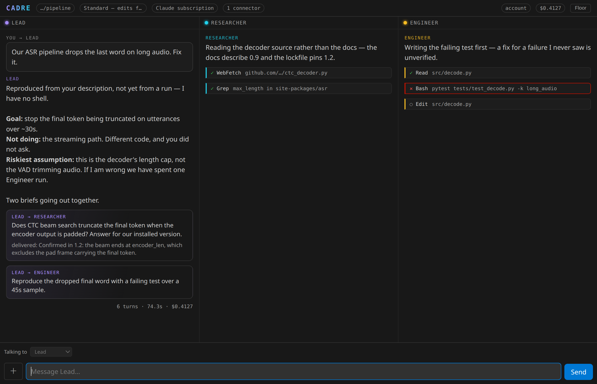
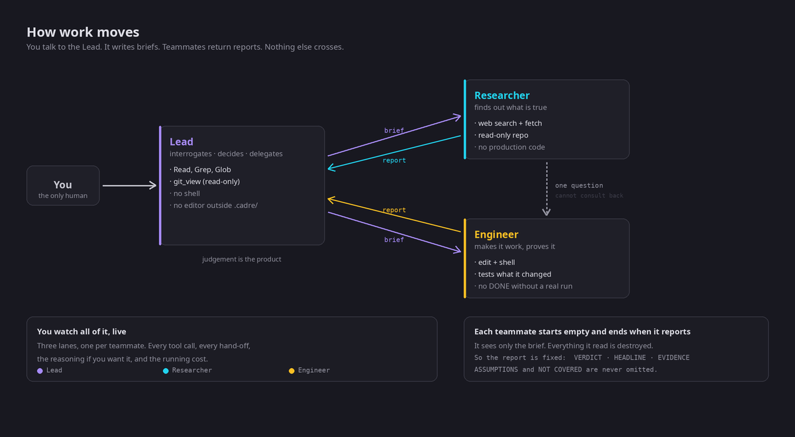
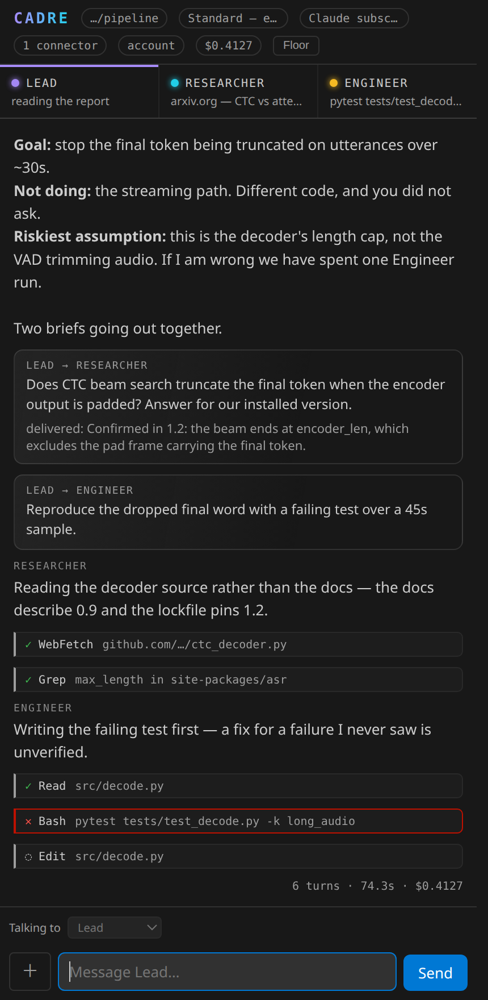
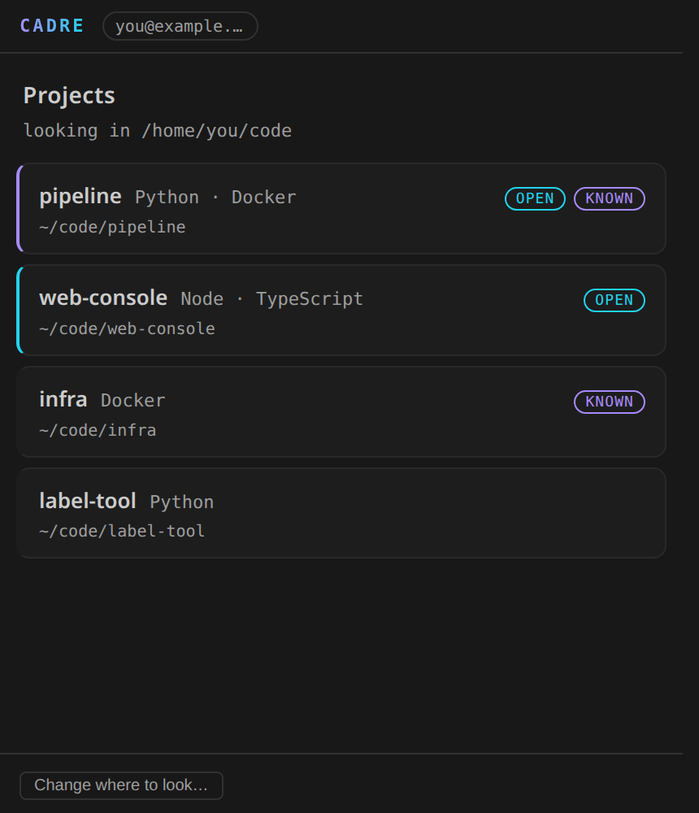
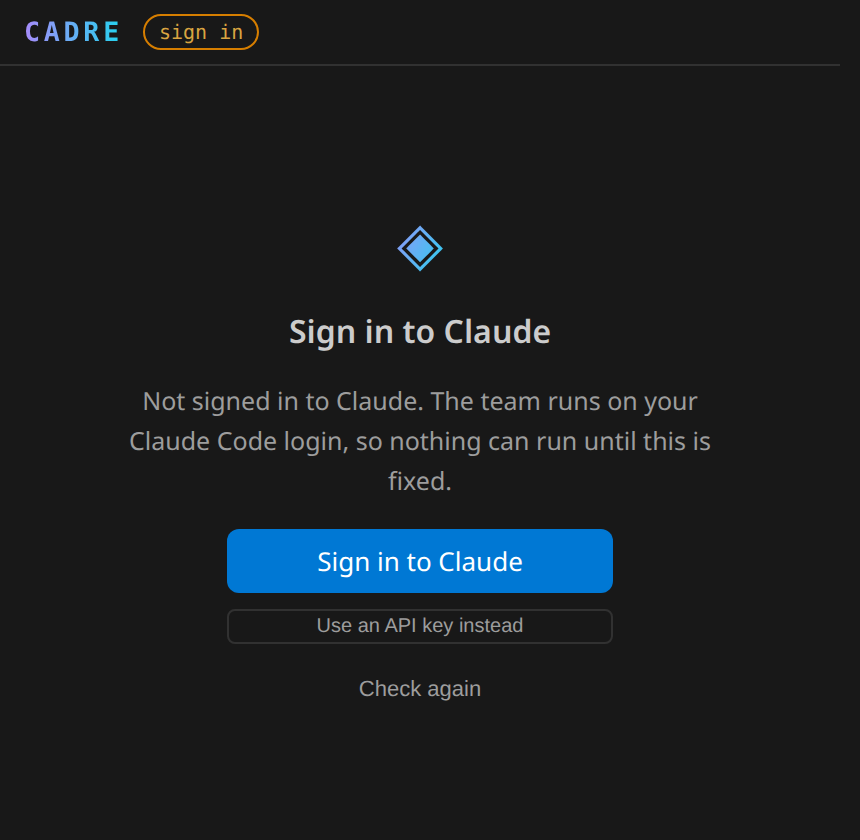

<div align="center">


# Cadre

**A small trained team of AI engineers, inside VS Code.**

You talk to the Lead. It interrogates the brief, decides scope, and puts a Researcher
and an Engineer to work — and you watch all three of them do it.



</div>

---

## What it actually is

Most AI coding tools are one assistant doing everything. Cadre is three, with different
jobs and different tools, and a Lead whose entire product is judgement:

| | | |
|---|---|---|
| **Lead** | The only one you talk to | Read, Grep, Glob, `git_view`. **No shell. No editor.** |
| **Researcher** | Reads papers, docs and the web | Web search and fetch, read-only repo access |
| **Engineer** | Writes, runs and proves the code | File editing and a shell |

The Lead having no keyboard is the design, not an oversight. A lead that can quietly do
the work itself will, and then the team is theatre.



## Requirements

[Claude Code](https://claude.com/claude-code) installed and signed in, or an Anthropic
API key. Cadre never holds your subscription login — it runs the CLI you already have.

## How work moves

The Lead delegates by writing a **brief**. The teammate starts with an empty context, sees
only that brief, returns exactly one **report**, and ceases to exist. The report is the
only thing that crosses back, so its shape is fixed:

```
VERDICT      DONE | PARTIAL | BLOCKED | REJECTED
HEADLINE     decision-first, divergence from the brief goes here
FINDINGS     (Researcher) graded claims, each with its source and date
CHANGES      (Engineer) one line per file — path:line → what changed and why
EVIDENCE     verbatim and addressed: commands, exit codes, path:line, URLs
ASSUMPTIONS  each with "if wrong:" — never omitted
NOT COVERED  what a reader would wrongly assume you checked — never omitted
NEXT         the cheapest next action, and who takes it
```

Two rules do most of the work. **The Engineer cannot report `DONE` without an execution
result** — unverified work is `PARTIAL`. And the Lead reads the diff of everything before
telling you it is done.

The Researcher and Engineer can consult each other directly. Depth is bounded by
capability rather than a counter: the consulted peer has no peer tool of its own, so a
consult cannot consult back.

## Watching it work

One responsive view. A merged stream in the sidebar; three live lanes past 760px; a
full-width **Team Floor** when you want the whole board. Status lights that pulse only
while a teammate is genuinely working, delegation cards showing what was handed to whom,
tool calls that resolve to ✓ or ✕, collapsed reasoning, running cost.

<table>
<tr>
<td width="34%" valign="top"><br><sub><b>Sidebar</b> — everything in one chronological stream.</sub></td>
<td width="33%" valign="top"><br><sub><b>Projects</b> — folders open, and projects beside them.</sub></td>
<td width="33%" valign="top"><br><sub><b>Signed out</b> — checked before you type, not after.</sub></td>
</tr>
</table>

## Talking to a teammate directly

By default you talk to the Lead and it delegates. Click the **Researcher** or **Engineer**
in the roster to open a direct line for a quick question — Cadre asks first, because the
Lead does not see a direct exchange and its picture of the work goes stale until you tell
it. Switch back with the **Talking to** dropdown.

## Surveying an unfamiliar project

**Cadre: Survey This Project** sends one framed request: work out what this project is,
how it is built, run and tested — with the commands *verified* rather than inferred from
config files — what a newcomer would get wrong, and what is risky. The result is written
to `PROJECT.md`, so later sessions start informed instead of re-deriving it.

## Images and long sessions

Attach a screenshot with **＋**, a paste, or a drop anywhere on the composer — the team
sees it. Oversized images are downscaled to 1568px on the long edge, past which the API
downsamples anyway and the extra pixels only cost tokens.

The header shows how full the context window is and turns amber past 80%. When it fills,
the history is summarised and the run continues rather than failing; the boundary is
recorded in the transcript so you know detail was dropped.

## Safety

Autonomy is enforced by the extension, not requested politely. It applies a
**restrictive-only policy tier** that can tighten but never widen — so it holds even if
your own Claude Code settings grant broader permissions than you remember.

| Level | |
|---|---|
| `supervised` | Every edit and command approved |
| `standard` | Edits flow; destructive commands ask |
| `plan` | Designs and reports, changes nothing |
| `autonomous` | No prompts |

Reads of `.env`, ssh keys and cloud credentials are **denied at every level**, including
`autonomous`. The Lead and Researcher cannot write outside `.cadre/` and your docs folder.
Permission prompts offer a narrowly scoped grant — *Always allow `pytest`* — rather than
handing over the whole tool.

## Projects

The home screen lists your projects and, beneath them, the conversations you have already
had in the current one — click to pick up where you left off. **CADRE** in the header
returns there from anywhere.

Multi-root aware, with a project home listing folders beside the ones already open.
Settings resolve per folder, so a sandbox can run cheap and autonomous while a production
repo runs supervised. Sessions resume. **Rewind Files** restores the workspace to an
earlier turn. Each teammate gets an orientation block built from what is actually on disk,
so the team does not start cold every time.

## Documentation it maintains

The Lead keeps `PROJECT.md` — including, for each decision, the alternative it rejected
and what would change its mind. The Researcher writes technical reports under `research/`,
revisited in place, keeping superseded answers with their dates. The Engineer keeps the
changelog and code-level docs.

Proportional by default: a one-line fix produces nothing.

## Settings

Everything is reachable from **Cadre: Settings**, or individually:

| | |
|---|---|
| `cadre.autonomy` | How much rope the team gets |
| `cadre.billing` | Subscription, or an API key in encrypted storage |
| `cadre.thinking` | Extended reasoning: `adaptive` or `off` |
| `cadre.<teammate>.model` / `.effort` | Per-teammate |
| `cadre.maxSpendUsd` | Hard ceiling per run |
| `cadre.documentation` / `.docsPath` | What gets documented, and where |
| `cadre.directLine` | Talk to a teammate without the Lead. Off by default |
| `cadre.playbooks` / `.connectors` / `.plugins` | Skills, MCP servers, local plugins |
| `cadre.checkpoints` | Snapshots so Rewind Files works |

## Honest limitations

- The Marketplace build omits the SDK's ~326 MB native CLI and uses your own Claude Code
  install. An older CLI exposes fewer tools.
- Every teammate is a real model run. This is not cheap; set `cadre.maxSpendUsd`.
- `hooks`, custom agents beyond the three, and sandboxing are not wired yet.

## Development

```sh
npm install
npm run build
npm run verify:fast    # 157 checks, no API calls
npm run verify:team    # a live three-agent run; costs tokens
```

<kbd>F5</kbd> opens an Extension Development Host on `sandbox/`.

The design, including the three system prompts verbatim, is in
[`docs/operating-model.md`](docs/operating-model.md). Contributions welcome — see
[CONTRIBUTING.md](CONTRIBUTING.md).

## License

MIT
